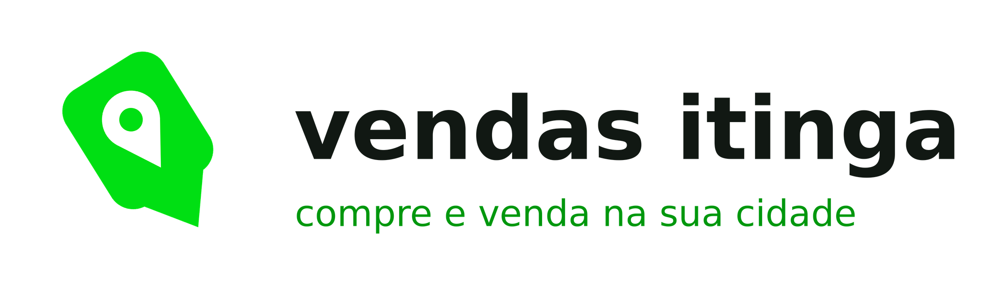

<p align="center">
  
</p>

<p align="center">
  <strong>Compre e venda na sua cidade.</strong><br>
  Marketplace local para Itinga-MG, com entrega própria e 7 dias para testar o produto.
</p>

---

## O que é

O Vendas Itinga é um app de compra e venda de produtos novos e usados dentro de
uma cidade só. Quem mora ali anuncia o que não usa mais, quem quer comprar
encontra pertinho de casa, e a entrega é feita por entregadores da própria
operação.

O projeto tem três partes:

| Pasta | O que é | Tecnologia |
|---|---|---|
| `app/` | O aplicativo Android | React Native + Expo, TypeScript |
| `servidor/` | A API: anúncios, pedidos, split, entregas, reembolsos | Node + Express + Prisma + PostgreSQL |
| `loja/` | Tudo que a Google Play pede: ficha, gráficos, políticas | textos e HTML prontos |

---

## As regras do negócio

| Regra | Valor |
|---|---|
| Venda mínima | **R$ 10,00** |
| Comissão | **12%** sobre o produto |
| Tarifa fixa por venda | R$ 2,50 (até 24,99) · R$ 4,50 (até 49,99) · R$ 6,50 (até 99,99) · R$ 8,50 (até 199,99) · R$ 18,50 (R$ 200+) |
| O que o comprador paga | só o preço do produto — a entrega está inclusa |
| Peso máximo por pacote | **20 kg** |
| Tamanho máximo (qualquer lado) | **60 cm** |
| Prazo para testar e devolver | **7 dias** a partir da entrega |
| Repasse ao vendedor | depois que o prazo de teste vence |
| Reembolso dentro do prazo | devolução **integral** (CDC art. 49) |
| Quem absorve comissão e tarifa na devolução | a plataforma |

Essas regras vivem em dois lugares e são checadas por teste automatizado:
`servidor/src/dominio/regras.ts` (manda) e `app/src/regras/limites.ts` (avisa a
pessoa antes de ela perder tempo).

```bash
cd servidor && npm test    # 53 testes: taxas, prazo, reembolso, máquina de estados e atribuição
```

---

## Rodando na sua máquina

### O app, sem servidor nenhum

Dá para abrir e navegar por todas as telas com dados de exemplo:

```bash
cd app
npm install
npm start          # leia o QR Code com o Expo Go
```

Sem `EXPO_PUBLIC_API_URL` configurado, o app entra em **modo demonstração**:
usa os dados de `app/src/dados/exemplo.ts` e não chama a rede.

> O login com Google e o pagamento não funcionam no Expo Go — eles precisam de
> um build de desenvolvimento. Veja `documentos/publicar-na-play-store.md`.

### A API

```bash
cd servidor
cp .env.exemplo .env       # preencha
npm install
npx prisma migrate dev
npm run dev                # sobe em http://localhost:3333
```

Confira: `curl http://localhost:3333/saude`

### Os dois juntos

No `app/.env`, aponte para o servidor:

```
EXPO_PUBLIC_API_URL=http://10.0.2.2:3333    # emulador Android
```

---

## As telas

| Aba | Tela | Arquivo |
|---|---|---|
| home | vitrine com carrosséis e busca | `app/src/telas/Home.tsx` |
| buscar | busca com filtros de preço e estado | `app/src/telas/Busca.tsx` |
| vendas | a lojinha, saldo a receber e dicas | `app/src/telas/Vendas.tsx` |
| notificações | negociações e mensagens | `app/src/telas/Notificacoes.tsx` |
| minha conta | perfil, atalhos e configurações | `app/src/telas/MinhaConta.tsx` |

Fora das abas: produto, checkout, pedido com linha do tempo, devolução, criar
anúncio, endereços, conta de recebimento, central de ajuda, exclusão de conta,
**área do entregador** (corridas passo a passo) e **painel administrativo**
(fila de entregas e devoluções).

### Logística

O módulo de entregas tem máquina de estados própria e não toca em dinheiro:

```
pago → aguardando agendamento → atribuída → aceita → a caminho da coleta
     → chegou → coletado (foto + volumes) → em rota → chegou → entregue
```

A devolução usa a mesma máquina no sentido inverso: o admin aprova, um
entregador busca no comprador e leva ao vendedor, e o **estorno só dispara
quando o vendedor recebe o produto de volta**. Detalhes em
**[`documentos/logistica.md`](documentos/logistica.md)**.

---

## Como o dinheiro anda

O split acontece na hora do pagamento, mas o valor fica **retido** no saldo da
pagar.me até o prazo de teste vencer. Se houver devolução dentro dos 7 dias, o
comprador recebe tudo de volta — inclusive o frete — e o estorno sai do saldo
certo de cada um, sem debitar o entregador.

O passo a passo, com exemplos numéricos e o checklist de homologação, está em
**[`documentos/split-pagarme.md`](documentos/split-pagarme.md)** — leia antes de
trocar as chaves de teste pelas de produção.

Por que a pagar.me e não outra, o que muda com a reforma tributária e a régua de
habitualidade dos vendedores estão em
**[`documentos/arquitetura-de-pagamento.md`](documentos/arquitetura-de-pagamento.md)**.

---

## Publicar na Play Store

O guia completo, do zero até o app no ar, está em
**[`documentos/publicar-na-play-store.md`](documentos/publicar-na-play-store.md)**.

Resumo:

```bash
cd app
npm install -g eas-cli && eas login && eas init
npm run build:teste       # APK para instalar e testar no celular
npm run build:producao    # AAB para enviar ao Play Console
```

Prontos para usar:

- `loja/ficha-da-loja.md` — nome, descrições e categoria já escritos
- `loja/graficos/icone-512.png` e `loja/graficos/capa-1024x500.png`
- `loja/politica-de-privacidade.html`, `termos-de-uso.html`, `exclusao-de-conta.html`
- `loja/seguranca-dos-dados.md` — respostas do formulário Data safety
- `loja/checklist-publicacao.md` — para conferir antes de enviar

Falta só você tirar as **capturas de tela** do app rodando e preencher os
`[COLCHETES]` com a razão social e o CNPJ da sua empresa.

---

## A marca

O verde **`#00DF13`** ocupa o lugar do roxo do app que serviu de referência. O
símbolo é uma sacola de compras sorridente, desenhada a partir do ícone que
você enviou — as proporções foram medidas na imagem original e reconstruídas em
vetor, para ficar nítido em qualquer tamanho.

Todos os arquivos saem de um script só:

```bash
pip install Pillow
python3 tools/gerar_marca.py
```

Isso regera ícone, adaptive icon, splash, favicon, logo horizontal e os gráficos
da Play Store. Para mudar a cor, altere `VERDE` no topo do script e rode de novo.

---

## Estrutura

```
app/                      aplicativo Expo
  assets/                 ícones e splash (gerados)
  src/
    api/                  cliente HTTP e tipos
    componentes/          peças de interface reaproveitadas
    contextos/            login com Google
    dados/                dados de exemplo (modo demonstração)
    navegacao/            abas e pilha de telas
    pagamento/            tokenização do cartão
    regras/               limites de peso e tamanho
    telas/                as telas do app
    tema/                 cores, espaçamentos e tipografia
servidor/
  prisma/schema.prisma    banco de dados
  src/
    dominio/              REGRAS DE NEGÓCIO (com testes)
    integracoes/          pagar.me e Google
    rotas/                endpoints HTTP
    servicos/             checkout, entrega, reembolso, repasse
loja/                     tudo da Google Play
documentos/               publicação, split, arquitetura de pagamento e logística
tools/gerar_marca.py      gerador da identidade visual
```

---

## Antes de vender de verdade

- [ ] Preencher `[RAZÃO SOCIAL]`, `[SEU CNPJ]` e endereço nos três HTML de `loja/`
- [ ] Rodar o checklist de homologação de `documentos/split-pagarme.md` inteiro
- [ ] Validar com um advogado o texto dos termos e a política de devolução
- [ ] Definir onde as fotos dos anúncios serão guardadas (S3, Cloudinary…) e
      ligar o upload em `app/src/telas/NovoAnuncio.tsx`
- [ ] Fazer uma compra real de valor baixo e acompanhar o dinheiro até o repasse
